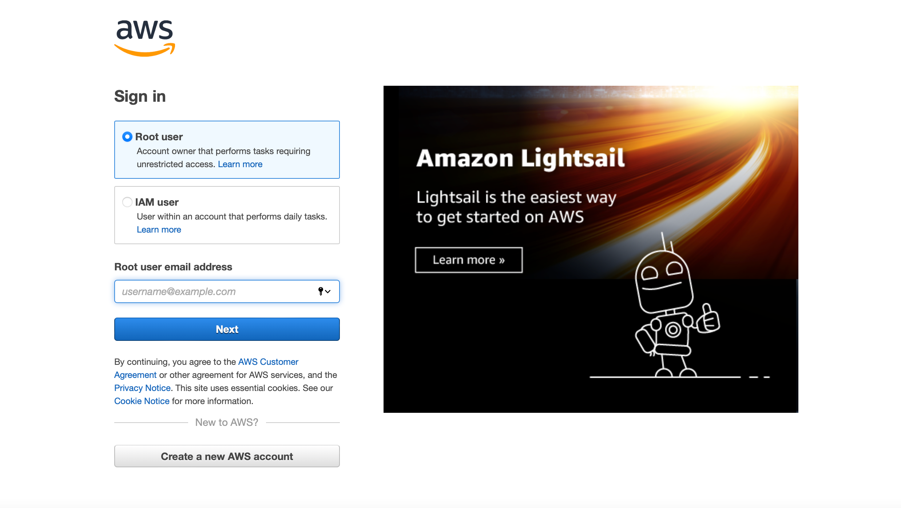
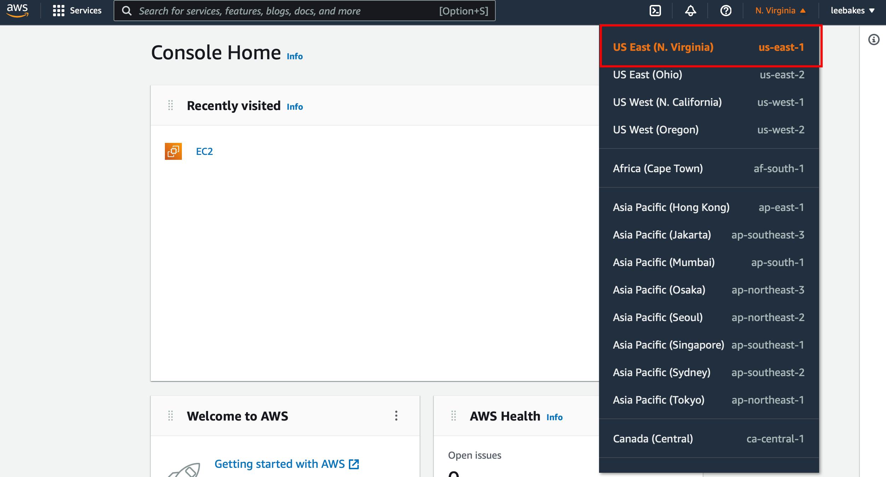
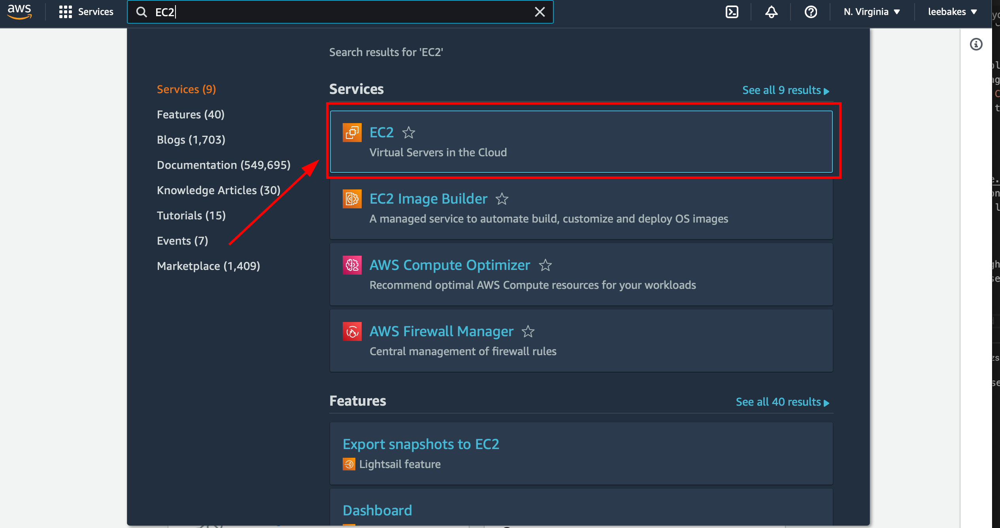
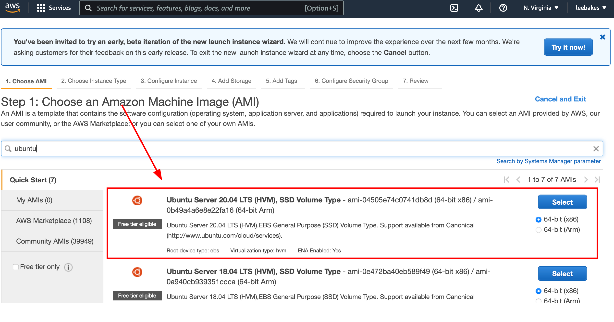
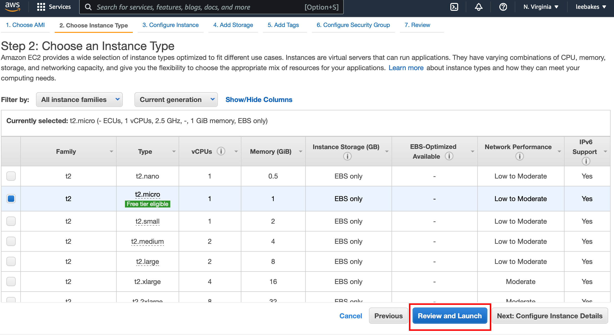
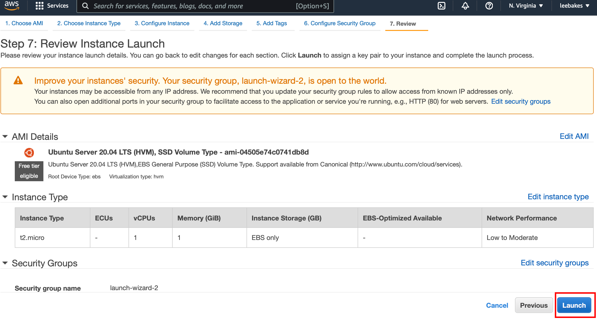
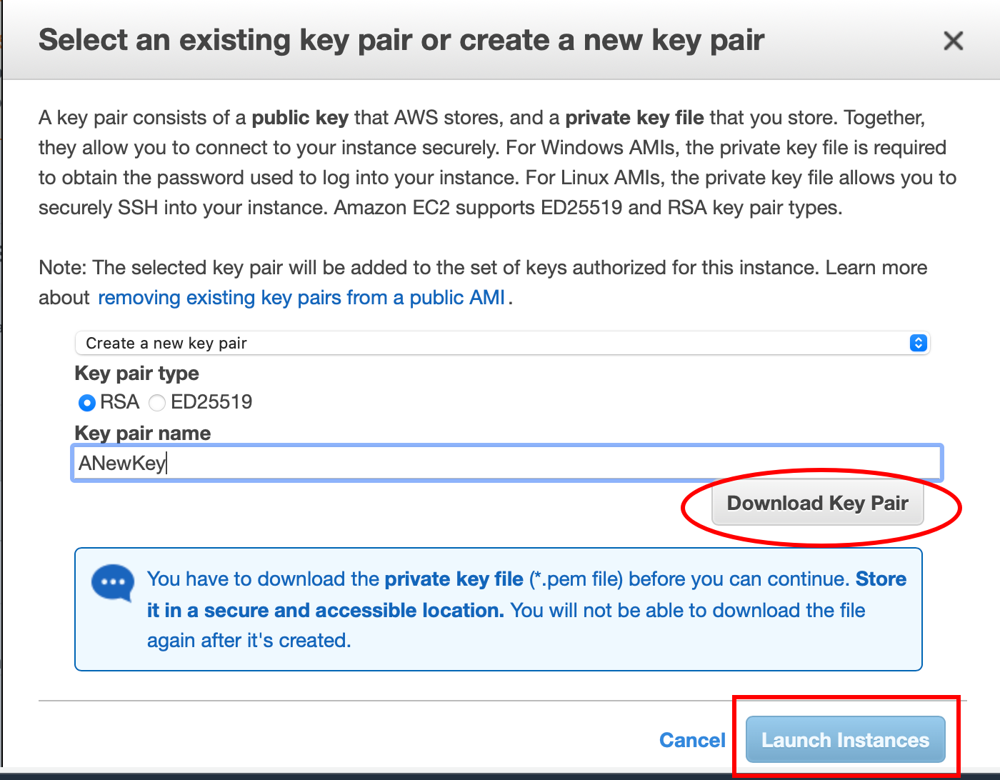
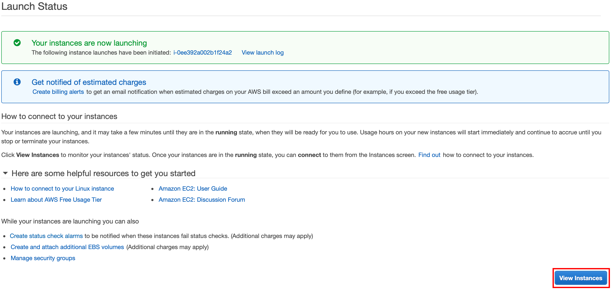

# web-stack-implementation

Hello and welcome to the Web Stack Implementation project!

What is a Web Stack? It is is a group of software components, used to implement or set up various applications (for example, a website). The "stack" refers to the specific layered components (e.g. OS system, webserver, script interpreter, and database) which are built on top of each other. One of the most popular web stacks include LAMP, which stands for Linux, Apache, MySQL, and PHP. The LAMP stack will be used for this project!

## LINUX
#### Setting up your virtual environment
 
 Linux is an operating system that manages the underlying hardware on your PC. It is an open-source software that is used worldwide. It is flexible and easy to configure.

In order to complete this project, it is necessary to set up a virtual environment. In order to achieve this, first, create a free [AWS account](https://aws.amazon.com) and then create a virtual server using the Ubuntu Server OS. More details to come shortly!

You may be wondering, 'what is AWS'? Amazon Web Services (AWS) is the leading Cloud Service Provider in the world. AWS offers a wide variety of databases and services for different types of applications. This allows users to choose the right tool for the job while receiving the best cost and performance.

AWS offers a Free Tier for newly registered account users. This enables users to try out some AWS services free of charge within certain usage limits. For this project, we will utilize the [EC2 (Elastic Compute Cloud)](https://aws.amazon.com/ec2/features/) service, which is covered by the Free Tier!

**Let's get started!**

Begin by registering and setting up an [AWS account](https://console.aws.amazon.com/console/home?region=us-east-1) and following the directions on the screen. Once you have created your AWS account, navigate to the login page and type in your credentials.

Once you have signed-in to your AWS account, navigate to the top-right of the screen and select your preferred region (this should be the closest region to your physical location).

After you have selected your region, navigate to the search bar and type in EC2. Select the EC2 service that appears.

Next, click on "Launch Instances".

Now we are going to configure our EC2 instance! Select the Ubuntu Server 20.04 LTS (HVM) as the Amazon Machine Image (AMI).

Then, select "t2.micro" as the instance type. Once you have made the selection, click "Review and Launch".

When you reach the "Review and Launch" page, click the "Launch" at the bottom-right of the page.

Next, you should see a window appear. Create a key pair and then select "Download". Don't lose it! You will need this file in order to connect into your server from your local PC. After you downloaded the key pair, check the box for the acknowledgement, and then click on "Launch Instances".

Great job! You've launched an EC2 instance! You can view your new instance by clicking the "View Instances" button at the bottom-right of your screen. Note: it may take a moment to initialize, so please be patient!

## Connecting to your EC2 from your local PC

